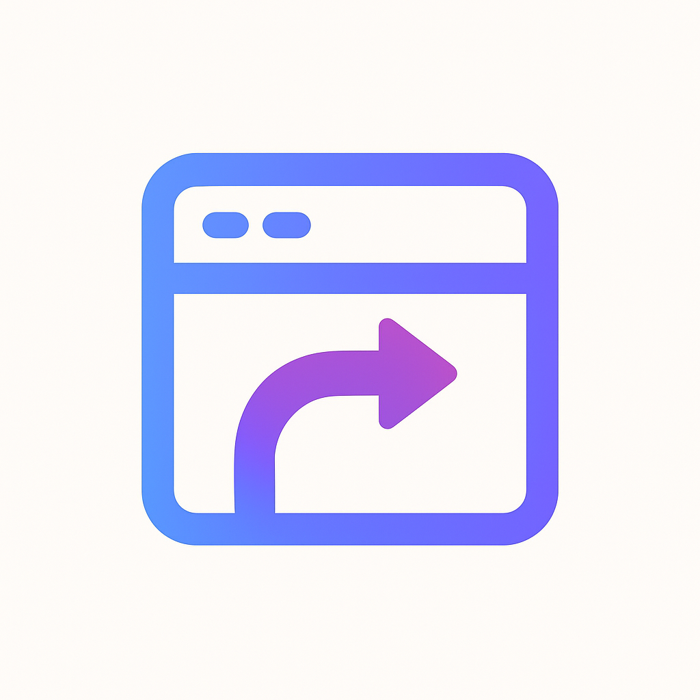

<div align="center">
    <h1 style="display:flex;align-items:center;gap:12px;margin:0">
        
        <span style="font-size:38px; font-weight:700; line-height:1; margin-left:8px;">Tablio</span>
    </h1>
    <p style="margin:8px 0 0;color:#6b7280"><em>The most customizable tab organization extension for your browser.</em></p>
</div>

Tablio transforms chaos into order by automatically organizing and renaming your browser tabs based on fully customizable URL patterns, groups, and visual indicators. Unlike other tab managers, Tablio gives you complete control over *exactly* how your tabs are named, organized, and displayed.

## ✨ Features

### Powerful Pattern Matching
- **Custom URL patterns** - Match any part of a URL to trigger automatic tab renaming
- **Priority-based ordering** - Patterns are checked top-to-bottom, so you control precedence
- **Flexible matching** - Match domains, subdomains, paths, or any URL substring
- **Per-pattern customization** - Each pattern can have its own name, color, and group

### Smart Organization
- **Custom groups with categories** - Create unlimited groups with emoji category icons
- **Keyword-based auto-grouping** - Tabs automatically join groups based on configurable keywords
- **Drag-and-drop reordering** - Organize both patterns and groups exactly how you want
- **Visual color coding** - Assign emoji color indicators (🔴🟠🟡🟢🔵🟣🟤⚫⚪) to any pattern

### Intelligent Automation
- **Auto-tidy mode** - Automatically organize tabs as they're created or updated
- **Smart title preservation** - Only renames tabs when patterns match, preserves original titles otherwise
- **Group emoji prefixes** - Optionally prefix tab titles with group category emojis
- **Bulk operations** - Select multiple patterns to delete or reassign groups at once

### Complete Customization
- **Import/Export settings** - Share configurations or backup your setup as JSON
- **Load recommended defaults** - Start with pre-configured patterns for popular sites
- **Granular control** - Every aspect is configurable: names, colors, groups, keywords, order
- **Search & filter** - Quickly find patterns by URL, name, or group

## 🎯 Usage
### Quick Start
1. Click the Tablio extension icon in your toolbar
2. Load the recommended default config: open **Settings** → click **"Load defaults"** to populate common patterns and groups
3. Select **"Tidy Now"** to organize all current tabs
4. Return to **Settings** to customize patterns, groups, colors, and keywords as desired

### Create Your First Pattern
1. Open Tablio settings
2. Click **"Add Pairing"** 
3. Enter a URL pattern (e.g., `github.com`)
4. Set a custom name (e.g., `GitHub`)
5. Choose a color emoji (e.g., 🟢)
6. Assign to a group (optional)
7. Tabs matching `github.com` will now display as "🟢 GitHub"

### Create Custom Groups
1. Go to the Groups section in settings
2. Click **"Add Group"**
3. Name your group (e.g., "Development")
4. Choose a category icon (e.g., 💻)
5. Add keywords for auto-matching (e.g., `github.com`, `gitlab.com`, `code`)
6. Tabs with those keywords will automatically join this group

### Advanced Customization

**Pattern Priority**: Arrange patterns by dragging them up or down. More specific patterns should be higher to take precedence.

**Keyword Matching**: Groups can automatically capture tabs based on keywords found in URLs (weighted 2x) or titles. Add multiple keywords for better matching.

**Bulk Actions**: Select multiple patterns with checkboxes to delete or reassign groups in one operation.

**Auto-Tidy**: Enable in settings to automatically organize tabs as you browse. Disable for manual control.

## 🎨 Example Configurations

### Developer Setup
#### Groups:
- Development (💻): github.com, gitlab.com, stackoverflow.com, localhost
- Docs (📖): developer.mozilla.org, docs.python.org
- Tools (🔧): aws.amazon.com, digitalocean.com

#### Patterns:
- github.com → 🟢 GitHub (Development)
- stackoverflow.com → 🟠 Stack Overflow (Development)
- localhost → 🔵 Local Dev (Development)

### Productivity Setup
#### Groups:
- Work (💼): email, calendar, docs, sheets
- Communication (💬): slack, discord, teams, mail
- Research (📚): wikipedia, arxiv, papers

#### Patterns:
- mail.google.com → 🔴 Gmail (Communication)
- docs.google.com → 🔵 Docs (Work)
- calendar.google.com → 🟡 Calendar (Work)


## 🔒 Privacy

**Tablio respects your privacy:**
- ✅ All data stored locally in your browser
- ✅ No external servers or data transmission
- ✅ No analytics or tracking
- ✅ Open source and auditable
- ✅ Works completely offline

## 📦 Installation

### Firefox
1. Download from [Firefox Add-ons](link-to-addon)
2. Or load manually:
   - Run `./create_dist.sh --no-zip`
   - Go to `about:debugging#/runtime/this-firefox`
   - Click "Load Temporary Add-on"
   - Select `manifest.json` from `dist/firefox/`

### Chrome/Edge
1. Download from [Chrome Web Store](link-to-store)
2. Or load manually:
   - Run `./create_dist.sh --no-zip`
   - Go to `chrome://extensions`
   - Enable "Developer mode"
   - Click "Load unpacked"
   - Select the `dist/chrome/` folder

## 🛠️ Development

```bash
# Build for both browsers (creates zips)
[create_dist.sh](http://_vscodecontentref_/0)

# Build without creating zips (for testing)
[create_dist.sh](http://_vscodecontentref_/1) --no-zip

# Firefox: dist/firefox/
# Chrome: dist/chrome/
```

## 🎯 Why Tablio?
Most tab managers force you into their way of organizing. Tablio is different:

- **You** choose how tabs are named
- **You** decide how they're grouped
- **You** control the visual indicators
- **You** set the automation rules
- **You** own your configuration
Whether you have 10 tabs or 100, Tablio adapts to *your* workflow, not the other way around.

## 📄 License
MIT License - see LICENSE for details
## 🤝 Contributing
Contributions welcome! This extension is built with:

- Vanilla JavaScript (ES6 modules)
- Bootstrap CSS for styling
- Browser extension APIs (Firefox & Chrome compatible)

### Reporting issues & suggesting features
Please open an issue on the project's GitHub repository. When possible, use the available issue templates.

- Bug reports
    - Prefix the title with "Bug:".
    - Include: steps to reproduce, expected vs actual behavior, browser and version, extension version, OS, relevant URL(s) or patterns, screenshots, and any console logs.
    - Provide a minimal reproducible example or an exported settings JSON when applicable.

- Feature requests / suggestions
    - Prefix the title with "Feature:" or "Suggestion:".
    - Describe the problem you want solved, the proposed behavior, a short justification (who benefits and why), and any mockups or examples.
    - Mention alternatives you considered.

- General tips
    - Search existing issues before opening a new one to avoid duplicates.
    - Keep descriptions concise and actionable.
    - Add labels or indicate whether the issue is a bug, enhancement, or question if you know how.
